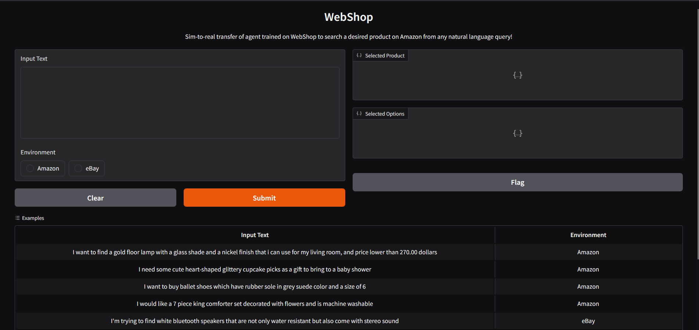

# Multiagent Retrieval Augmented Generation for E-commerce product search
## Description
SearchSwarm is a specialized multi-agent large language model (LLM) framework for product search in e-commerce websites.
## Installation
**Note:** Use Python 3.8.13
1. Install dependencies
```bash
pip install -r requirements.txt
```
2. Rename *config_template.json* to *config.json* and add OpenAI API key.
3. (Optional). If you want to use Hugging Face model, change code in *test.py* like this:
```python
#from agents.search_swarm_amazon import SearchSwarm
from agents.search_swarm_outlines import SearchSwarm
```
## Run on WebShop environment
1. Set up the [webshop](https://github.com/princeton-nlp/WebShop) environment on http://localhost:3000. You can find an example docker file for webshop in *other* folder.
2. Command to get inference from webshop environment.
```bash
python test.py --max_episodes <LIMIT ON EPISODES>
--instruction_count <COUNT OF INSTRUCTIONS>
--save <FILE TO SAVE PROGRESS>
--resume <FILE TO RESTORE PROGRESS>
--debug (OPTIONAL)
```

## Run on Amazon
1. Command to test search in [amazon.com](https://www.amazon.com/)
```bash
python test_amazon.py
```
2. Choose interface mode (I) or you can provide a file with list of instructions (T). Example of such file is in *other/product_list.json* 
3. Go to http://localhost:7860/
4. Choose Amazon and write your instruction to find a product:
